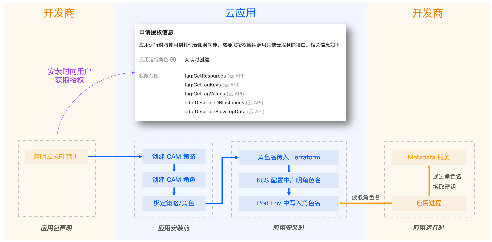

# 云应用模板-CVM内调用云API

> 包含云资源：CVM实例 
> 
> 本示例主要演示：如何在CVM实例内获取临时密钥并调用云API


## 云API调用原理



## 目录说明

.cloudapp：云应用根目录
 - infrastructure：资源及变量定义目录
    - variable.tf：变量定义
    - deployment.tf：资源定义
    - provider.tf：全局公共参数（固定不变）
 - scripts：执行脚本（启动、初始化等）
    - startup.sh：启动脚本
    - main.js：应用程序（nodejs）

## 使用说明
- 通常，你需要根据自身项目架构及资源需求修改 ```.cloudapp/infrastructure/variable.tf``` 的变量内容，具体修改部分参照文件中的注释说明。

- 你需要修改 ```.cloudapp/package.yaml``` 中的 ```id``` 为自己的云应用ID

- 需要将 ```.cloudapp/scripts``` 目录下的脚本，按照自身项目需求修改，并打包到CVM镜像的 ```/usr/local/cloudapp``` 目录下，在安装实例时，会执行相应的启动脚本

- 在CVM初始化时，将会自动执行 ```/usr/local/cloudapp/startup.sh``` 启动脚本

## 云API调用
主要分为3个步骤：

- 1 应用安装时注入CAM角色名
- 2 通过 ```metedata``` 服务获取 ```API临时密钥```
- 3 调用云API

具体参照 ```.cloudapp/scripts/main.js``` 应用程序调用云API示例

临时密钥请求示例：
```sh
# $CLOUDAPP_CAM_ROLE 为动态注入的环境变量
curl http://metadata.tencentyun.com/meta-data/cam/security-credentials/$CLOUDAPP_CAM_ROLE
```
响应的密钥结果：
```json
{
  "TmpSecretId": "AKIDbfAmu6************kC4NL21Af9RDYF-ru50MqZV2mZXuiO5S4Ly5_IWM-rukFQK",
  "TmpSecretKey": "1Xho6SoJ3P***************+9Qw6ffnChY=",
  "ExpiredTime": 1658866289,
  "Expiration": "2022-07-26T20:11:29Z",
  "Token": "eIEKy0l6rWu*******w5K2FBnVjvwl",
  "Code": "Success"
}
```